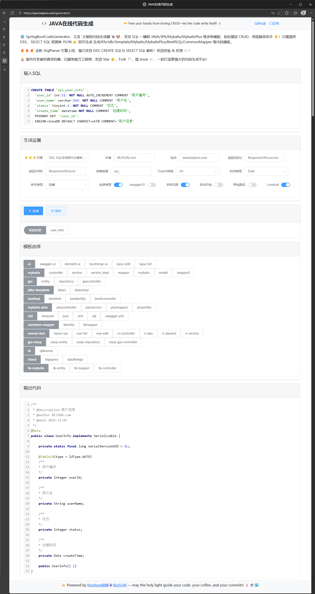

# SpringBootCodeGenerator 大狼狗代码生成器
----
又名`Java代码生成器`、`JAVA在线代码生成平台`、`sql转java`、`大狼狗代码生成器`、`mybatis在线生成器`、`SQL转Java JPA、MYBATIS实现类代码生成平台`<br>


[](https://github.com/moshowgame/SpringBootCodeGenerator/actions/workflows/maven.yml)

# Author
>🚀
Powered by `Moshow郑锴(大狼狗)` 🌟 Might the holy code be with you !
> <br>**`CSDN`传送门**️️➡️ [https://zhengkai.blog.csdn.net](https://zhengkai.blog.csdn.net)
> <br>**微信公众号**➡️`软件开发大百科`

# Description
本项目是基于 Spring Boot 3 和 Freemarker 的高效代码生成平台，旨在帮助开发者告别繁琐重复的 CRUD 操作，释放双手，让开发更高效。项目支持主流数据库（MySQL、Oracle、PgSQL）和多种模板（JPA、Mybatis、MybatisPlus 等）。
> 🚀 `Spring Boot Code Generator` — a powerful code generation platform built on SpringBoot3 & Freemarker  
> ✨ 基于 `SpringBoot3` 和 `Freemarker` 的高效代码生成平台

> 👐 Say goodbye to repetitive CRUD work — free your hands and boost productivity  
> 💡 告别繁琐重复的 CRUD 操作，释放你的双手，让开发更高效！

> 🛠️ Supports MySQL, Oracle, and PostgreSQL — the most popular SQL dialects  
> 📦 支持主流数据库：`MySQL`、`Oracle`、`PgSQL`，标准 SQL 一网打尽

> ⚙️ Generate templates from DDL, INSERT SQL, SELECT SQL, or simple JSON — covering JPA, JdbcTemplate, Mybatis, MybatisPlus, BeetlSQL, CommonMapper  
> 🧩 通过建表 DDL、插入 SQL、选择 SQL 或简单 JSON，一键生成 `JPA/JdbcTemplate/Mybatis/MybatisPlus/BeetlSQL/CommonMapper` 等模板代码

> 🙏 Thanks for your continued support! BeJSON once peaked at 1.5K daily PV 👀, and now maintains a steady flow of around 600 visits — plus 2K+ GitHub Stars ✨. Your feedback remains our greatest motivation to keep improving!
> ❤️ 感谢大家一直以来的支持！BeJSON 曾创下日均访问量 1.5K 👀 的高峰，目前稳定在约 600 左右，GitHub Star 数也已突破 2K ✨。你们的反馈始终是我们不断前进的最大动力！

> 🌈 Wishing everyone balance, health, and success — may your code be bug-free and your coffee strong ☕  
> 💬 祝大家工作顺利，生活平衡，身体健康，步步高升，代码无 bug，咖啡够劲！

> 📬 Feel free to submit issues, share useful templates, or contribute your brilliant ideas via PR  
> 🤝 欢迎提交问题、分享常用模板，或将你的灵感通过 PR 实现！

> 🙌 Special thanks to BeJSON 前站长 `三叔` 的慧眼与支持，让项目得以脱颖而出，感恩！


## 功能特性

### 支持多种生成模式
- DDL SQL 模式：通过建表语句生成代码
- INSERT SQL 模式：通过插入语句生成代码
- SELECT SQL 模式：通过查询语句生成代码
- JSON 模式：通过 JSON 数据生成代码

### 支持多种模板
- JPA 模板
- MyBatis 模板
- MyBatis-Plus 模板
- BeetlSQL 模板
- CommonMapper 模板
- TkMyBatis 模板
- JDBC Template 模板
- 前端 UI 模板（Element UI、Bootstrap UI 等）

### 其他特性
- 自动记忆最近生成的内容
- 支持特殊字符模板（# 用 井 代替，$ 用 ￥ 代替）
- 可设置表名前缀
- 可选择是否自动引包
- 支持本地/CDN 静态资源引入模式切换

## 技术栈

- Spring Boot 3
- Freemarker 模板引擎
- FastJSON2
- JSqlParser SQL 解析器
- Lombok 简化代码工具

## 使用说明

### 启动项目

```bash
# 克隆项目
git clone https://github.com/moshowgame/SpringBootCodeGenerator.git

# 进入项目目录
cd SpringBootCodeGenerator
# 编译项目
mvn clean compile
# 运行项目
mvn spring-boot:run
```

项目启动后访问 http://localhost:1234/generator

### 添加新模板

1. 在 `resources/templates/code-generator` 目录中找到对应类型
2. 复制并编写 Freemarker 模板文件（.ftl）
3. 修改 `template.json` 文件，新增模板信息

### 配置说明

| **配置项** | **说明** | **默认值** |
|:----|:----|:----|
| 作者 | authorName | zhengkai.blog.csdn.net |
| 包名 | packageName | cn.devtools |
| 返回(成功) | returnUtilSuccess | Return.SUCCESS |
| 返回(失败) | returnUtilFailure | Return.ERROR |
| 忽略前缀 | ignorePrefix | sys_ |
| 输入类型 | dataType | DDL SQL |
| TinyInt转换 | tinyintTransType | int |
| 时间类型 | timeTransType | Date |
| 命名类型 | nameCaseType | CamelCase/驼峰 |
| 是否包装类型 | isPackageType | true |
| 是否swaggerUI | isSwagger | false |
| 是否字段注释 | isComment | true |
| 是否自动引包 | isAutoImport |  |
| 是否带包路径 | isWithPackage |  |
| 是否Lombok | isLombok | true |

| **模板变量**         | **说明**             | 
|:-------------|:---------------|
| tableName    | sql中的表名        |
| className    | java类名         |
| classComment | sql表备注/java类备注 |
| fieldName    | 字段名            |
| fieldComment | 字段备注           |


## 重构2025说明

本项目的重构2025在原有基础上进行了现代化重构，优化了项目结构和代码组织，使其更符合现代 Spring Boot 应用的最佳实践。

### 重构亮点

1. **清晰的分层架构**：采用 Controller-Service-DTO-VO 分层设计，各层职责明确
2. **接口与实现分离**：服务层采用接口与实现分离的设计，便于测试和扩展
3. **策略模式应用**：使用策略模式处理不同类型的 SQL 解析，易于扩展新的解析方式
4. **现代化开发规范**：遵循 Spring Boot 和 Java 开发最佳实践
5. **完善的异常处理**：统一异常处理机制，提供更友好的错误提示

### 重构后项目结构

```
com.softdev.system.generator
├── GeneratorApplication.java              # 启动类
├── config                                # 配置类包
│   ├── WebMvcConfig.java                 # MVC配置
│   └── GlobalExceptionHandler.java       # 全局异常处理器
├── controller                            # 控制层
│   ├── PageController.java               # 页面跳转控制器
│   ├── CodeGenController.java            # 代码生成相关接口
│   └── TemplateController.java           # 模板相关接口
├── service                               # 服务层接口
│   ├── CodeGenService.java               # 代码生成服务接口
│   ├── TemplateService.java              # 模板服务接口
│   └── parser                            
│       ├── SqlParserService.java         # SQL解析服务接口
│       └── JsonParserService.java        # JSON解析服务接口
├── service.impl                          # 服务实现层
│   ├── CodeGenServiceImpl.java           # 代码生成服务实现
│   ├── TemplateServiceImpl.java          # 模板服务实现
│   └── parser
│       ├── SqlParserServiceImpl.java     # SQL解析服务实现
│       └── JsonParserServiceImpl.java    # JSON解析服务实现
├── entity                                # 实体类
│   ├── dto                              
│   │   ├── ParamInfo.java                # 参数信息DTO
│   │   ├── ClassInfo.java                # 类信息DTO
│   │   └── FieldInfo.java                # 字段信息DTO
│   ├── vo                               
│   │   └── ResultVo.java                 # 统一返回结果VO
│   └── enums                            
│       └── ParserTypeEnum.java           # 解析类型枚举
├── util                                  # 工具类包
│   ├── FreemarkerUtil.java               # Freemarker工具类
│   ├── StringUtilsPlus.java              # 字符串工具类
│   ├── MapUtil.java                      # Map工具类
│   ├── mysqlJavaTypeUtil.java            # MySQL类型转换工具类
│   └── exception                        
│       ├── CodeGenException.java         # 自定义业务异常
│       └── SqlParseException.java        # SQL解析异常
└── constant                              # 常量定义
    └── CodeGenConstants.java             # 代码生成常量(待实现)
```

### 统一响应格式

所有控制器方法均返回 ResultVo 统一响应对象，保持与前端的兼容性：

```java
// 成功响应
ResultVo.ok(data);

// 错误响应
ResultVo.error(message);
```

## 重构优势

1. **结构清晰**：通过合理的包结构和分层设计，使项目结构更加清晰易懂
2. **易于维护**：各层职责明确，便于定位和修复问题
3. **易于扩展**：采用策略模式等设计模式，便于添加新的功能模块
4. **现代化**：遵循 Spring Boot 和 Java 的最新最佳实践
5. **前后端兼容**：保持与现有前端代码的数据交互格式，无缝升级

## 升级问题解决方案

### FastJSON 升级到 FastJSON2

如果在升级 FastJSON 到 FastJSON2 版本时遇到 FastJsonHttpMessageConverter 找不到类问题以及 FastJsonConfig 找不到问题，需要安装以下类库：
- fastjson2
- fastjson2-extension
- fastjson2-extension-spring6

### Spring Boot 3 升级

当项目从 Spring Boot 2.x 升级到 3.x 时，可能会遇到 "java: 程序包 javax.servlet.http 不存在" 问题，这是因为 Spring Boot 3 使用了 Jakarta EE 9+，包名从 javax.* 变更为 jakarta.*。


## 版权信息

本项目遵循相关开源协议，欢迎提交问题、分享常用模板，或将你的灵感通过 PR 实现！

## Stargazers over time
[](https://starchart.cc/moshowgame/SpringBootCodeGenerator)

2025 NewUI V2版本<br>

配置模板<br>

网站流量分析-2024<br>

代码与你，越变越强<br>


# Update Logs
| 更新日期       | 更新内容                                                                                                                                                                                                                                                              |
|:-----------|:------------------------------------------------------------------------------------------------------------------------------------------------------------------------------------------------------------------------------------------------------------------|
| 2025.12.07 | 后端重构优化！[REFACTORING_DOCUMENT.md](REFACTORING_DOCUMENT.md) ;目录结构调整!                                                                                                                                                                                                |
| 2025.09.14 | 优化JSqlParser Engine(DDL Create SQL和Select SQL),适配更高级复杂的SQL                                                                                                                                                                                                        |
| 2025.09.13 | JSqlParser Engine全新升级，目前Select SQL模式相对稳定! <br>更新SpringBoot等类库版本，修复漏洞<br>修复CDN问题，切换为staticfile.org                                                                                                                                                                 |
| 2025.09.06 | 处理建表字段包含 using 字符时无法生成对应字段的情况(感谢@wubiaoo的反馈和@willxiang的PR)                                                                                                                                                                                                        |
| 2025.03.31 | 优化说明                                                                                                                                                                                                                                                              |
| 2025.03.16 | NewUI V2前端优化：<br>移除不必要内容，优化Local和CDN静态文件引入。<br><br>修复由于SQL类型大写导致无法转换的问题。（感谢@zzy-design的反馈）<br><br>JPA模板优化（感谢@PenroseYang的反馈）：<br>修复不开启Lombok情况下Set/Get方法生成问题;<br>修复importDdate判断为true后没有引入日期类的问题<br>                                                              |
| 2024.12.29 | 优化前端加载速度，优化输出代码着色，CDN改字节跳动静态资源公共库。<br>                                                                                                                                                                                                                            |
| 2024.12.23 | 新增InsertSQL模式，采用JSQLParser引擎进行封装<br>优化代码封装<br>CDN恢复为staticfile.org加速(如果本地卡的话，建议切换local模式)。<br>                                                                                                                                                                    |
| 2024.04.23 | 切换为更快更稳定的BootCDN进行加速。<br>前端NEWUI改版（基于AdminLTE+Bootstrap+Vue+ElementUI混合模式）。                                                                                                                                                                                       |
| 2024.04.22 | [Java CI with Maven](https://github.com/moshowgame/SpringBootCodeGenerator/actions/workflows/maven.yml) 更新<br>SpringBoot升级到3.2.5<br>FastJSON升级到FastJSON2.0.49                                                                                                     |
| 2024.04.21 | 推出JDK11分支，支持JDK8/JDK11/JDK17等版本，兼容性较好但维护速度较慢，为了更好兼容旧机器和旧环境                                                                                                                                                                                                        |
| 2024.04.20 | 修复CDN版本cdn.staticfile.org域名备份失败问题，已同步更新到cdn.staticfile.net（本地版本则不受影响）                                                                                                                                                                                             |
| 2024.01.26 | 修复大写下滑线列名转驼峰问题（感谢@Nisus-Liu的PR）                                                                                                                                                                                                                                   |
| 2023.10.22 | 工具站CDN更新。                                                                                                                                                                                                                                                         |
| 2023.08.31 | （感谢@Nisus-Liu的PR）<br>fix 驼峰列名转命名风格错误问题<br>增强转下划线命名风格, 对原始风格不敏感. 支持各种命名风格的列名 to 下划线<br>增加 NonCaseString 大小写不敏感字符串包装类, 简化编码<br>几点代码小优化。                                                                                                                             |
| 2023.07.11 | 安全更新，正式支持SpringBoot3，javax升级到jakarta。                                                                                                                                                                                                                             |
| 2023.01.02 | 新增TkMybatis模板（感谢@sgj666的建议）。                                                                                                                                                                                                                                      |
| 2023.01.01 | 新增GCP BigQuery/Dataflow JJS/QlikSense BI模板。                                                                                                                                                                                                                       |  
| 2022.09.28 | MySQL to Java type conversion 数据库类型转换优化（感谢@jadelike得贡献）                                                                                                                                                                                                           | 
| 2022.07.02 | add the script to install and run，添加批处理以便直接构建或运行项目。                                                                                                                                                                                                               |
| 2022.02.10 | 更新springboot、fastjson、lombok依赖（感谢@Abbykawai的建议）。                                                                                                                                                                                                                  |  
| 2022.02.09 | 新增JPA-STARP模板（感谢@starplatinum3的贡献）。                                                                                                                                                                                                                               |  
| 2022.01.11 | 优化mybatis的mapper文件生成（感谢@chendong的贡献）。                                                                                                                                                                                                                             |  
| 2021.10.31 | 优化当有索引和额外的换行时的解析逻辑（感谢@feitian124的贡献）。<br>修复部分模板参数不对应（感谢@Thixiaoxiao的贡献）。<br>新增cookie记录所需配置字段逻辑,避免重复配置（感谢@Thixiaoxiao的贡献）。                                                                                                                                         |
| 2021.08.07 | 新增当前模板保持功能，重新生成代码后依然会保持在当前选择模板。<br>新增renren-fast模板。                                                                                                                                                                                                               |
| 2021.08.05 | 解决 update 方法语法错误；调整部分语句避免sonarLint告警(感谢@Henry586的PR);<br>add swagger-yml.ftl(感谢@fuuqiu的PR);<br>支持common-mapper&修复entity和plusentity的swagger引包错误(感谢@chentianming11的PR)                                                                                              |
| 2021.03.24 | 修复Mybatis.XML中缺失test=关键字问题。(感谢@BWHN/YUEHUI的反馈)。                                                                                                                                                                                                                   |
| 2021.01.18 | OEM信息优化，支持多配置文件模式，支持在application*.yml自定义信息，以及切换local/cdn模式。                                                                                                                                                                                                       |
| 2021.01.17 | 生成后自动trim掉前后空格输出。<br>完善ReadMe文档。<br>优化云CDN引入部分。<br>优化returnUtil部分。<br>表明前缀选项(感谢@wwlg的建议)。 <br>是否带字段注释设置(感谢@fengpojian的建议)。<br>优化Mybatis的''!=判断(感谢@zhongsb的建议)。<br>Mybatis-Plus增加Service层(感谢@yf466532479的建议)。                                                      |
| 2021.01.16 | 全新3.0版本：<br>一、前端半vue半js化，更多动态加载项。<br>二、支持更多生成设置，优化生成场景。<br>三、js导入支持本地/CDN模式，支持断网环境轻松使用。                                                                                                                                                                           |
| 2020.10.22 | 1.tinyint多加一个Short类型转换（感谢@wttHero的建议）                                                                                                                                                                                                                             |
| 2020.10.20 | 1.修复mapper2 insert代码问题（感谢@mXiaoWan的PR）<br>2.优化对fulltext/index关键字的处理（感谢@WEGFan的反馈）。<br>3.新增日期类型的转换选择（感谢@qingkediguo的建议）。<br>4.新增是否包装类型的转换选择(感谢@gzlicanyi的建议)。                                                                                                      |
| 2020.06.28 | 优化Util下的BeanUtil，支持更多map.put的操作。整合CRUD模板到SQL(CRUD)模板。                                                                                                                                                                                                             |
| 2020.06.21 | 修复FreemarkerUtil的Path问题导致JAR包运行时无法获取template的问题。                                                                                                                                                                                                                  |
| 2020.05.25 | 1.一些fix,关于封装工具类以及layui模板优化等.<br> 2.优化表备注的获取逻辑.<br> 3.生成时间格式改为yyyy-MM-dd,移除具体的时间,只保留日期                                                                                                                                                                             |
| 2020.05.22 | 1.新增insert-sql模式,支持对"insert into table (xxx) values (xxx)"语句进行处理,生成java代码(感谢三叔的建议).                                                                                                                                                                               |
| 2020.05.17 | 1.代码重构！异常处理优化,Freemarker相关工具类优化,简化模板生成部分,通过template.json来配置需要生成的模板,不需要配置java文件.<br> 2.修复包含comment关键字时注释无法识别的问题.(感谢@1nchaos的反馈).<br> 3.赞赏优化,感谢大家的赞赏.<br> 4.新增mapper2(Mybatis-Annotation模板)(感谢@baisi525和@CHKEGit的建议).                                               |
| 2020.05.03 | 1.优化对特殊字符的处理,对于包含#和$等特殊字符的,在模板使用井和￥代替便可,escapeString方法会自动处理.<br> 2.优化mybatisplus实体类相关(感谢@chunchengmeigui的反馈).<br> 3.修优化对所有类型的判断(感谢@cnlw的反馈).<br> 4.移除swagger-entity,该功能已经包含在‘swagger-ui’的下拉选项中  <br> 5.升级hutool和lombok版本                                          |
| 2020.03.06 | 1.提交一套layuimini+mybatisplus的模板.<br> 2.修复mybatisplus一些相关问题.                                                                                                                                                                                                        |
| 2020.02.06 | 1.新增历史记录功能,自动保存最近生成的对象.<br> 2.新增swagger开关选项和修复@Column带name参数(感谢@liuyu-struggle的建议).<br> 3.去除mybatis模板中的方括号[]和修改模板里的类注释样式(感谢@gaohanghang的PR)                                                                                                                       |
| 2019.12.29 | 1.修复bejson安全防护策略拦截问题(感谢@liangbintao和@1808083642的反馈).<br> 2.优化字段名含date字符串的处理(感谢@smilexzh的反馈).<br> 3.控制台动态输出项目访问地址(感谢@gaohanghang的提交)                                                                                                                               |
| 2019.11.28 | 1.修复支持string-copy导致的以n结尾的字母不显示问题.<br> 2.jpa-entity新增swagger@ApiModel@ApiModelProperty注解和SQL字段@Column注解(感谢@yjq907的建议)                                                                                                                                              |   
| 2019.11.26 | 1.springboot2内置tomcat更换为性能更强大的undertow.<br> 2.修复tinyintTransType参数丢失问题                                                                                                                                                                                            |   
| 2019.11.24 | 1.java代码结构优化.<br> 2.新增简单的json生成模式.<br> 3.新增简单的正则表达式匹配模式(感谢@ydq的贡献).<br> 4.新增对复制String代码中的乱SQL代码的支持 5.优化对JSON的父子节点/处理,JSONObject和JSONArray节点处理,子节点缺失'{'头处理                                                                                                         |   
| 2019.11.23 | 1.移除频繁出错和被过滤的layer,改为jquery-toast.<br> 2.Util功能优化,新增json和xml.                                                                                                                                                                                                     |   
| 2019.11.16 | 优化对primary关键字的处理(感谢@liujiansgit的反馈).                                                                                                                                                                                                                              |   
| 2019.11.15 | 1.添加tinyint类型转换(感谢@lixiliang&@liujiansgit的Suggestion).<br> 2.添加一键复制功能(感谢@gaohanghang的Suggestion).<br> 3.Mybatis的insert增加keyProperty="id"用于返回自增id(感谢@88888888888888888888的Suggestion).<br> 4.优化date类型的支持(感谢@SteveLsf的反馈).<br> 5.其他一些优化.                            | 
| 2019.10.15 | 修复jdbcTemplates中insert语句第一个字段丢失的问题.                                                                                                                                                                                                                               |   
| 2019.09.15 | 1.添加对象getset模板.<br> 2.添加sql模板.<br> 3.启动类添加日志输出,方便项目使用(感谢@gaohanghang 的pull request)                                                                                                                                                                               |   
| 2019.09.10 | 优化以及更新Maven依赖,减少打包体积.<br> 1.修复mapper接口load方法,但是xml中方法不匹配问题.<br> 2.移除mapper中CRUD时的@param 注解,会影响xml的解析(感谢@caojiantao的反馈).<br> 3.优化MyBatis的xml文件对Oracle的支持.(感谢@wylove1992的反馈).<br> 4.新增对boolean的处理(感谢@violinxsc的反馈)以及优化tinyint类型生成boolean类型问题(感谢@hahaYhui的反馈)        |   
| 2019.09.09 | 添加是否下划线转换为驼峰的选择(感谢@youngking28 的pull request).                                                                                                                                                                                                                    |   
| 2019.05.18 | 1.优化注释.<br> 2.修改 mybatis模板中 controller注解.<br> 3.修改 mybatis模板中 dao文件使用为 mapper文件.<br> 4.修改 mybatis模板中 service实现类中的一个 bug.<br> 5.修改 index.ftl文件中 mybatis模板的 dao -> mapper(感谢@unqin的pull request)                                                                    |
| 2019.05.11 | 优化mybatis模块的dao和xml模板,修改dao接口注解为@Repository,所有dao参数改为包装类,删除update语句最后的UpdateTime = NOW(),修改dao接口文件的方法注释使其更符合javaDoc的标准,修改insert语句增加插入行主键的返回,修改load的方法名为selectByPrimaryKey,修改xml的update语句新增动态if判空,修改xml的insert语句新增动态插入判空,更符合mybatisGenerator标准(感谢@Archer-Wen的贡献 ). |
| 2019.04.29 | 新增返回封装工具类设置.<br> 优化对oracle注释comment on column的支持(感谢@liukex反馈).<br> 优化对普通和特殊storage关键字的判断(感谢@AhHeadFloating的反馈 ).                                                                                                                                                  |
| 2019.02.11 | 提交gitignore,解决StringUtils.lowerCaseFirst潜在的NPE异常,校验修改为@RequestParam参数校验,lombok之@Data和@Slf4j优化,fix JdbcDAO模板类名显示为中文问题,WebMvcConfig整合MessageConverter,模板代码分类(感谢@liutf和@tfgzs的pull request).                                                                         |
| 2019.02.10 | 实体生成规则切换为包装类型,不再采用基本数据类型,为实体类生成添加显示的默认构造方法(感谢@h2so的pull request).                                                                                                                                                                                                 |
| 2019.01.06 | 修复处理number/decimal(x,x)类型的逻辑(感谢@arthaschan的反馈).<br> 修复JdbcTemplates模板两处错误(感谢@everflourish的反馈).                                                                                                                                                                    |
| 2018.12.12 | 首页UI优化.<br> 新增MybatisPlus模块(感谢@三叔同事的建议).<br> 修复作者名和包名获取失败问题(感谢@Yanch1994的反馈).                                                                                                                                                                                     |
| 2018.11.22 | 优化正则表达式点号的处理,优化处理字段类型,对number类型增加int,long,BigDecimal的区分判断(感谢@lshz0088的指导).                                                                                                                                                                                        |
| 2018.11.08 | 修复非字段描述"KEY FK_xxxx (xxxx)"导致生成KEY字段情况(感谢@tornadoorz反馈).                                                                                                                                                                                                          |
| 2018.10.18 | 支持double(x,x)的类型,以及comment里面包含一些特殊字符的处理(感谢@tanwubo的反馈).                                                                                                                                                                                                           |
| 2018.10.10 | CDN变更,修复CDN不稳定导致网页js报错问题.                                                                                                                                                                                                                                         |
| 2018.10.03 | 新增element-ui/bootstrap生成.                                                                                                                                                                                                                                         |
| 2018.10.02 | 修复公共CDN之Layer.js404问题,导致项目无法生成.                                                                                                                                                                                                                                   |
| 2018.09.27 | 优化COMMENT提取逻辑,支持多种复杂情况的注释(感谢@raodeming的反馈).                                                                                                                                                                                                                       |
| 2018.09.26 | 全新BeetlSQL模块,以及一些小细节优化(感谢@三叔同事的建议).                                                                                                                                                                                                                               |
| 2018.09.25 | 优化SQL表和字段备注的推断,包括pgsql/oralce的comment on column/table情况处理等.                                                                                                                                                                                                       |
| 2018.09.18 | 优化SQL类型推断.<br> 优化PrimaryKey判断.<br> 修复jpacontroller中Repository拼写错误问题.                                                                                                                                                                                              |
| 2018.09.17 | 全新首页,静态文件全部采用CDN.新增jdbcTemplate模块.                                                                                                                                                                                                                                |
| 2018.09.16 | 1.优化oracle支持,优化DDL语句中"或者'或者空格的支持.<br> 2.补充char/clob/blob/json等类型,如果类型未知,默认为String.                                                                                                                                                                                |
| 2018.09.15 | 新增Swagger-UI模板.修复一些命名和导入问题.JPA的Entity默认第一个字段为Id,如果不是请手工修改.                                                                                                                                                                                                        |
| 2018.09.13 | 修复字段没有描述以及类型为DATE型导致的问题.新增JPA的Controller模板.                                                                                                                                                                                                                       |
| 2018.08.31 | 初始化项目.新增JPA系列Entity+Repository模板.                                                                                                                                                                                                                                 |
