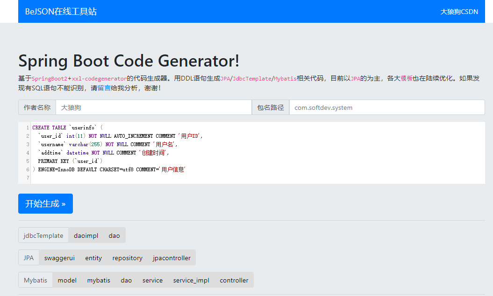
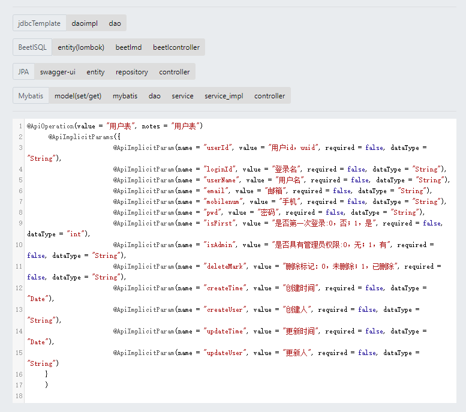
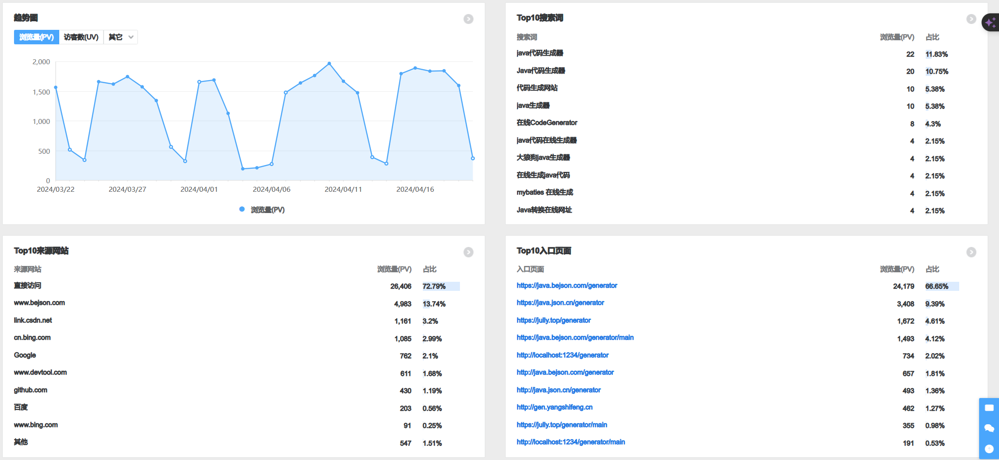

# SpringBootCodeGenerator
----
又名`Java代码生成器`、`JAVA在线代码生成平台`、`sql转java`、`大狼狗代码生成器`、`mybatis在线生成器`、`SQL转Java JPA、MYBATIS实现类代码生成平台` 

# Author
>powered by `Moshow郑锴(大狼狗)` , [https://zhengkai.blog.csdn.net](https://zhengkai.blog.csdn.net)

# Description
>Based on SpringBoot2+Freemarker 
>          #基于`SpringBoot2`和`Freemarker`的代码生成平台
> 
>For reducing the repetitive CRUD work 
>          #以解放双手为目的，减少大量的`重复CRUD工作`
>
>Support mysql, oracle and pgsql 
>          #支持`MySQL`、Oracle、PgSQL三大主流数据库
>
>Generate to many predefined popular templates by DDL-SQL/Insert-SQL/Simple JSON 
>   可通过`建表SQL语句`或`INSERT语句`或者`简单JSON`生成预设的`JPA/JdbcTemplate/Mybatis/MybatisPlus/BeetlSQL/CommonMapper`相关模板代码.
>
>Thanks for your using and feedback,I'm inspired by the 1500+PV (AVG) every day and github more than 1.9K stars  
>   感谢大家的使用和反馈，每天1500的PV和获得超过九百多的星星是我前进和继续做下去的动力。
> 
>Hope everyone can keep good balance on work and life , stay health and safety . I wish you success in your new position and get promoted step by step.   
>   愿大家可以维持生活和工作平衡，保持健康和安全，祝大家工作顺利，步步高升！
>Please submit your issue and template , or pull your good idea into the PR  
>   提交你的问题和生成模板，或者提交你的好主意到PR。

# URL

- 感谢`卡卡`将他部署在[BEJSON](https://java.bejson.com/generator)上，目前是besjon专供的`金牌工具`(线上版本不一定是最新的，会有延迟，请谅解，谢谢). 
- 感谢`jully.top`部署的副本 [https://jully.top/generator/](https://jully.top/generator/)。 
- 感谢`BootCDN`提供稳定、快速、免费的前端开源项目 CDN 加速服务
- Thanks for `JetBrains` providing us the `Licenses for Open Source Development` ，[Get free access to all JetBrains tools for developing your open source project!](https://www.jetbrains.com/community/opensource/#support) . 

| 访问地址                   | http://localhost:1234/generator                               |
|:-----------------------|:--------------------------------------------------------------|
| BEJSON 金牌工具 在线地址           | https://java.bejson.com/generator/                            |
| JSON.CN 金牌工具 在线地址         | https://java.json.cn/generator/                            |
| Jully 在线地址             | https://jully.top/generator/                                  |
| DEVTOOLS 在线地址（Demised） | https://java.devtools.cn                                      |
| CSDN BLOG              | https://zhengkai.blog.csdn.net                                |
| GITEE仓库                | https://gitee.com/moshowgame/SpringBootCodeGenerator/releases |
| GITHUB仓库               | https://github.com/moshowgame/SpringBootCodeGenerator         |

# Tips or Features
- 支持`DDL SQL`/`INSERT SQL`/`SIMPLE JSON`三种生成模式
- `自动记忆`最近生成的内容，最多保留9个
- 提供众多`通用模板`，易于使用，复制粘贴加简单修改即可完成CRUD操作
- 支持`特殊字符`模板(`#`请用`井`代替;`$`请用`￥`代替)
- `Util集合`提供一些基本对象的使用方法供方便COPY，如对应的CRUD SQL语句、setMap、getMap、get属性等等
- 关于`类名注释`，可根据`comment=(mysql)`或者`comment on table(pgsql/oracle)`生成
- 可设置是否`自动引包`(java中的import)及`引入包路径`(java类中的package)，建议取消并配合IDEA的自动引包更智能(Settings→Editor→General→Auto Import,勾选Add unambiguous imports on the fly以及Optimize imports on the fly)。
- 可设置`表名前缀`，例如sys_user前缀为sys_之后可以正确生成user类
- 可在`applicaltion.yml`中的`OEM.mode`设置`js/css引入模式`为`local`(本地模式，默认)/`CDN`(云CDN模式，在线网站推荐，省流量)
- OEM信息可以在`applicaltion.yml`中的`OEM`中更改
- *支持公共js/css的Local/CDN模式切换，方便`本地`或者`工具站`进行部署，可以在`application.yml`的`OEM.Mode=`进行设置，之后请在`header-CDN-v2.html`/`header-local-v2.html`中检查对应js/css配置是否正确。默认为`CDN`模式。对于没有网络的环境请使用`local`模式。

# Branch Detail 分支介绍
- Master：主力分支，基于SpringBoot3+，需要JDK17+
- JDK11：兼容分支，基于SpringBoot2+，支持JDK8/JDK11/JDK17等版本，请自行(切换jdk11分支)[https://github.com/moshowgame/SpringBootCodeGenerator/tree/jdk11]
- NewUI：新UI界面改版尝鲜

# 更新预告
1.计划引入DJANGO等其他语言的ORM模板，欢迎大家submit相关代码供参考

# Update Logs
| 更新日期       | 更新内容                                                                                                                                                                                                                                                              |
|:-----------|:------------------------------------------------------------------------------------------------------------------------------------------------------------------------------------------------------------------------------------------------------------------|
| 2024.04.23 | 切换为更快更稳定的BootCDN进行加速。 前端NEWUI改版（基于AdminLTE+Bootstrap+Vue+ElementUI混合模式）。|
| 2024.04.22 | [Java CI with Maven](https://github.com/moshowgame/SpringBootCodeGenerator/actions/workflows/maven.yml) 更新 SpringBoot升级到3.2.5 FastJSON升级到FastJSON2.0.49|
| 2024.04.21 | 推出JDK11分支，支持JDK8/JDK11/JDK17等版本，兼容性较好但维护速度较慢，为了更好兼容旧机器和旧环境|
| 2024.04.20 | 修复CDN版本cdn.staticfile.org域名备份失败问题，已同步更新到cdn.staticfile.net（本地版本则不受影响）|
| 2024.01.26 | 修复大写下滑线列名转驼峰问题（感谢@Nisus-Liu的PR）|
| 2023.10.22 | 工具站CDN更新。                                                                                                                                                                                                                                                         |
| 2023.08.31 | （感谢@Nisus-Liu的PR） fix 驼峰列名转命名风格错误问题 增强转下划线命名风格, 对原始风格不敏感. 支持各种命名风格的列名 to 下划线 增加 NonCaseString 大小写不敏感字符串包装类, 简化编码 几点代码小优化。                                                                                                                             |
| 2023.07.11 | 安全更新，正式支持SpringBoot3，javax升级到jakarta。                                                                                                                                                                                                                             |
| 2023.01.02 | 新增TkMybatis模板（感谢@sgj666的建议）。                                                                                                                                                                                                                                      |
| 2023.01.01 | 新增GCP BigQuery/Dataflow JJS/QlikSense BI模板。                                                                                                                                                                                                                       |  
| 2022.09.28 | MySQL to Java type conversion 数据库类型转换优化（感谢@jadelike得贡献）                                                                                                                                                                                                           | 
| 2022.07.02 | add the script to install and run，添加批处理以便直接构建或运行项目。                                                                                                                                                                                                               |
| 2022.02.10 | 更新springboot、fastjson、lombok依赖（感谢@Abbykawai的建议）。                                                                                                                                                                                                                  |  
| 2022.02.09 | 新增JPA-STARP模板（感谢@starplatinum3的贡献）。                                                                                                                                                                                                                               |  
| 2022.01.11 | 优化mybatis的mapper文件生成（感谢@chendong的贡献）。                                                                                                                                                                                                                             |  
| 2021.10.31 | 优化当有索引和额外的换行时的解析逻辑（感谢@feitian124的贡献）。 修复部分模板参数不对应（感谢@Thixiaoxiao的贡献）。 新增cookie记录所需配置字段逻辑,避免重复配置（感谢@Thixiaoxiao的贡献）。                                                                                                                                         |
| 2021.08.07 | 新增当前模板保持功能，重新生成代码后依然会保持在当前选择模板。 新增renren-fast模板。                                                                                                                                                                                                               |
| 2021.08.05 | 解决 update 方法语法错误；调整部分语句避免sonarLint告警(感谢@Henry586的PR); add swagger-yml.ftl(感谢@fuuqiu的PR); 支持common-mapper&修复entity和plusentity的swagger引包错误(感谢@chentianming11的PR)                                                                                              |
| 2021.03.24 | 修复Mybatis.XML中缺失test=关键字问题。(感谢@BWHN/YUEHUI的反馈)。                                                                                                                                                                                                                   |
| 2021.01.18 | OEM信息优化，支持多配置文件模式，支持在application*.yml自定义信息，以及切换local/cdn模式。                                                                                                                                                                                                       |
| 2021.01.17 | 生成后自动trim掉前后空格输出。 完善ReadMe文档。 优化云CDN引入部分。 优化returnUtil部分。 表明前缀选项(感谢@wwlg的建议)。  是否带字段注释设置(感谢@fengpojian的建议)。 优化Mybatis的''!=判断(感谢@zhongsb的建议)。 Mybatis-Plus增加Service层(感谢@yf466532479的建议)。                                                      |
| 2021.01.16 | 全新3.0版本： 一、前端半vue半js化，更多动态加载项。 二、支持更多生成设置，优化生成场景。 三、js导入支持本地/CDN模式，支持断网环境轻松使用。                                                                                                                                                                           |
| 2020.10.22 | 1.tinyint多加一个Short类型转换（感谢@wttHero的建议）                                                                                                                                                                                                                             |
| 2020.10.20 | 1.修复mapper2 insert代码问题（感谢@mXiaoWan的PR） 2.优化对fulltext/index关键字的处理（感谢@WEGFan的反馈）。 3.新增日期类型的转换选择（感谢@qingkediguo的建议）。 4.新增是否包装类型的转换选择(感谢@gzlicanyi的建议)。                                                                                                      |
| 2020.06.28 | 优化Util下的BeanUtil，支持更多map.put的操作。整合CRUD模板到SQL(CRUD)模板。                                                                                                                                                                                                             |
| 2020.06.21 | 修复FreemarkerUtil的Path问题导致JAR包运行时无法获取template的问题。                                                                                                                                                                                                                  |
| 2020.05.25 | 1.一些fix,关于封装工具类以及layui模板优化等.  2.优化表备注的获取逻辑.  3.生成时间格式改为yyyy-MM-dd,移除具体的时间,只保留日期                                                                                                                                                                             |
| 2020.05.22 | 1.新增insert-sql模式,支持对"insert into table (xxx) values (xxx)"语句进行处理,生成java代码(感谢三叔的建议).                                                                                                                                                                               |
| 2020.05.17 | 1.代码重构！异常处理优化,Freemarker相关工具类优化,简化模板生成部分,通过template.json来配置需要生成的模板,不需要配置java文件.  2.修复包含comment关键字时注释无法识别的问题.(感谢@1nchaos的反馈).  3.赞赏优化,感谢大家的赞赏.  4.新增mapper2(Mybatis-Annotation模板)(感谢@baisi525和@CHKEGit的建议).                                               |
| 2020.05.03 | 1.优化对特殊字符的处理,对于包含#和$等特殊字符的,在模板使用井和￥代替便可,escapeString方法会自动处理.  2.优化mybatisplus实体类相关(感谢@chunchengmeigui的反馈).  3.修优化对所有类型的判断(感谢@cnlw的反馈).  4.移除swagger-entity,该功能已经包含在‘swagger-ui’的下拉选项中    5.升级hutool和lombok版本                                          |
| 2020.03.06 | 1.提交一套layuimini+mybatisplus的模板.  2.修复mybatisplus一些相关问题.                                                                                                                                                                                                        |
| 2020.02.06 | 1.新增历史记录功能,自动保存最近生成的对象.  2.新增swagger开关选项和修复@Column带name参数(感谢@liuyu-struggle的建议).  3.去除mybatis模板中的方括号[]和修改模板里的类注释样式(感谢@gaohanghang的PR)                                                                                                                       |
| 2019.12.29 | 1.修复bejson安全防护策略拦截问题(感谢@liangbintao和@1808083642的反馈).  2.优化字段名含date字符串的处理(感谢@smilexzh的反馈).  3.控制台动态输出项目访问地址(感谢@gaohanghang的提交)                                                                                                                               |
| 2019.11.28 | 1.修复支持string-copy导致的以n结尾的字母不显示问题.  2.jpa-entity新增swagger@ApiModel@ApiModelProperty注解和SQL字段@Column注解(感谢@yjq907的建议)                                                                                                                                              |   
| 2019.11.26 | 1.springboot2内置tomcat更换为性能更强大的undertow.  2.修复tinyintTransType参数丢失问题                                                                                                                                                                                            |   
| 2019.11.24 | 1.java代码结构优化.  2.新增简单的json生成模式.  3.新增简单的正则表达式匹配模式(感谢@ydq的贡献).  4.新增对复制String代码中的乱SQL代码的支持 5.优化对JSON的父子节点/处理,JSONObject和JSONArray节点处理,子节点缺失'{'头处理                                                                                                         |   
| 2019.11.23 | 1.移除频繁出错和被过滤的layer,改为jquery-toast.  2.Util功能优化,新增json和xml.                                                                                                                                                                                                     |   
| 2019.11.16 | 优化对primary关键字的处理(感谢@liujiansgit的反馈).                                                                                                                                                                                                                              |   
| 2019.11.15 | 1.添加tinyint类型转换(感谢@lixiliang&@liujiansgit的Suggestion).  2.添加一键复制功能(感谢@gaohanghang的Suggestion).  3.Mybatis的insert增加keyProperty="id"用于返回自增id(感谢@88888888888888888888的Suggestion).  4.优化date类型的支持(感谢@SteveLsf的反馈).  5.其他一些优化.                            | 
| 2019.10.15 | 修复jdbcTemplates中insert语句第一个字段丢失的问题.                                                                                                                                                                                                                               |   
| 2019.09.15 | 1.添加对象getset模板.  2.添加sql模板.  3.启动类添加日志输出,方便项目使用(感谢@gaohanghang 的pull request)                                                                                                                                                                               |   
| 2019.09.10 | 优化以及更新Maven依赖,减少打包体积.  1.修复mapper接口load方法,但是xml中方法不匹配问题.  2.移除mapper中CRUD时的@param 注解,会影响xml的解析(感谢@caojiantao的反馈).  3.优化MyBatis的xml文件对Oracle的支持.(感谢@wylove1992的反馈).  4.新增对boolean的处理(感谢@violinxsc的反馈)以及优化tinyint类型生成boolean类型问题(感谢@hahaYhui的反馈)        |   
| 2019.09.09 | 添加是否下划线转换为驼峰的选择(感谢@youngking28 的pull request).                                                                                                                                                                                                                    |   
| 2019.05.18 | 1.优化注释.  2.修改 mybatis模板中 controller注解.  3.修改 mybatis模板中 dao文件使用为 mapper文件.  4.修改 mybatis模板中 service实现类中的一个 bug.  5.修改 index.ftl文件中 mybatis模板的 dao -> mapper(感谢@unqin的pull request)                                                                    |
| 2019.05.11 | 优化mybatis模块的dao和xml模板,修改dao接口注解为@Repository,所有dao参数改为包装类,删除update语句最后的UpdateTime = NOW(),修改dao接口文件的方法注释使其更符合javaDoc的标准,修改insert语句增加插入行主键的返回,修改load的方法名为selectByPrimaryKey,修改xml的update语句新增动态if判空,修改xml的insert语句新增动态插入判空,更符合mybatisGenerator标准(感谢@Archer-Wen的贡献 ). |
| 2019.04.29 | 新增返回封装工具类设置.  优化对oracle注释comment on column的支持(感谢@liukex反馈).  优化对普通和特殊storage关键字的判断(感谢@AhHeadFloating的反馈 ).                                                                                                                                                  |
| 2019.02.11 | 提交gitignore,解决StringUtils.lowerCaseFirst潜在的NPE异常,校验修改为@RequestParam参数校验,lombok之@Data和@Slf4j优化,fix JdbcDAO模板类名显示为中文问题,WebMvcConfig整合MessageConverter,模板代码分类(感谢@liutf和@tfgzs的pull request).                                                                         |
| 2019.02.10 | 实体生成规则切换为包装类型,不再采用基本数据类型,为实体类生成添加显示的默认构造方法(感谢@h2so的pull request).                                                                                                                                                                                                 |
| 2019.01.06 | 修复处理number/decimal(x,x)类型的逻辑(感谢@arthaschan的反馈).  修复JdbcTemplates模板两处错误(感谢@everflourish的反馈).                                                                                                                                                                    |
| 2018.12.12 | 首页UI优化.  新增MybatisPlus模块(感谢@三叔同事的建议).  修复作者名和包名获取失败问题(感谢@Yanch1994的反馈).                                                                                                                                                                                     |
| 2018.11.22 | 优化正则表达式点号的处理,优化处理字段类型,对number类型增加int,long,BigDecimal的区分判断(感谢@lshz0088的指导).                                                                                                                                                                                        |
| 2018.11.08 | 修复非字段描述"KEY FK_xxxx (xxxx)"导致生成KEY字段情况(感谢@tornadoorz反馈).                                                                                                                                                                                                          |
| 2018.10.18 | 支持double(x,x)的类型,以及comment里面包含一些特殊字符的处理(感谢@tanwubo的反馈).                                                                                                                                                                                                           |
| 2018.10.10 | CDN变更,修复CDN不稳定导致网页js报错问题.                                                                                                                                                                                                                                         |
| 2018.10.03 | 新增element-ui/bootstrap生成.                                                                                                                                                                                                                                         |
| 2018.10.02 | 修复公共CDN之Layer.js404问题,导致项目无法生成.                                                                                                                                                                                                                                   |
| 2018.09.27 | 优化COMMENT提取逻辑,支持多种复杂情况的注释(感谢@raodeming的反馈).                                                                                                                                                                                                                       |
| 2018.09.26 | 全新BeetlSQL模块,以及一些小细节优化(感谢@三叔同事的建议).                                                                                                                                                                                                                               |
| 2018.09.25 | 优化SQL表和字段备注的推断,包括pgsql/oralce的comment on column/table情况处理等.                                                                                                                                                                                                       |
| 2018.09.18 | 优化SQL类型推断.  优化PrimaryKey判断.  修复jpacontroller中Repository拼写错误问题.                                                                                                                                                                                              |
| 2018.09.17 | 全新首页,静态文件全部采用CDN.新增jdbcTemplate模块.                                                                                                                                                                                                                                |
| 2018.09.16 | 1.优化oracle支持,优化DDL语句中"或者'或者空格的支持.  2.补充char/clob/blob/json等类型,如果类型未知,默认为String.                                                                                                                                                                                |
| 2018.09.15 | 新增Swagger-UI模板.修复一些命名和导入问题.JPA的Entity默认第一个字段为Id,如果不是请手工修改.                                                                                                                                                                                                        |
| 2018.09.13 | 修复字段没有描述以及类型为DATE型导致的问题.新增JPA的Controller模板.                                                                                                                                                                                                                       |
| 2018.08.31 | 初始化项目.新增JPA系列Entity+Repository模板.                                                                                                                                                                                                                                 |

# ClassInfo/TableInfo
|名称|说明|
|:----|:----|
|packageName|自定义的包名|
|authorName|自定义的作者名|
|tableName|sql中的表名|
|className|java类名|
|classComment|sql表备注/java类备注|
|fieldName|字段名|
|fieldComment|字段备注|

# Options
|名称|说明|默认值|
|:----|:----|:----|
|作者 |authorName|zhengkai.blog.csdn.net|
|包名 |packageName|cn.devtools|
|返回(成功)|returnUtilSuccess|Return.SUCCESS|
|返回(失败)|returnUtilFailure|Return.ERROR|
|忽略前缀|ignorePrefix |sys_|
|输入类型 |dataType|DDL SQL|
|TinyInt转换 |tinyintTransType|int|
|时间类型 |timeTransType|Date|
|命名类型 |nameCaseType|CamelCase/驼峰|
|是否包装类型 |isPackageType|true|
|是否swaggerUI|isSwagger|false|
|是否字段注释|isComment|true|
|是否自动引包|isAutoImport||
|是否带包路径|isWithPackage||
|是否Lombok|isLombok|true|

# How to add a new template
1. `resources/templates/code-generator`中找到对应类型
2. COPY并编写freemarker模板文件`.ftl`
3. 修改`template.json`文件，新增模板信息，页面可动态加载

# Upgrade Issue Resolution 升级问题解决方案
- 如果你最近也在升级FastJson到FastJson2版本，而跟我一样也遇到了FastJsonHttpMessageConverter找不到类问题以及FastJsonConfig找不到问题，那么恭喜你，看完本文，安装完fastjson2、fastjson2-extension、fastjson2-extension-spring6这三个类库，你就可以成功使用新版FastJson2了。
 [FastJson2中FastJsonHttpMessageConverter找不到类问题](https://blog.csdn.net/moshowgame/article/details/138013669)

- 当项目从2.7.x的springboot升级到3.0.x的时候，遇到一个问题“java: 程序包javax.servlet.http不存在” 问题：
 [java: 程序包javax.servlet.http不存在](https://zhengkai.blog.csdn.net/article/details/131362304)

2024 NEWUI版本

2021 半Vue半JS版本

2019 初代版本

配置模板

网站流量分析-2024

网站流量分析-2022

代码与你，越变越美

