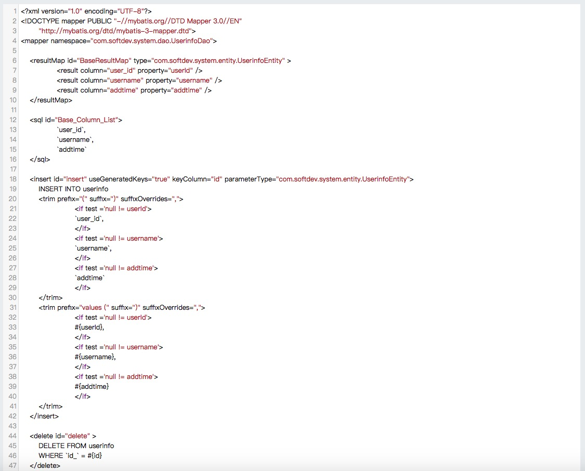
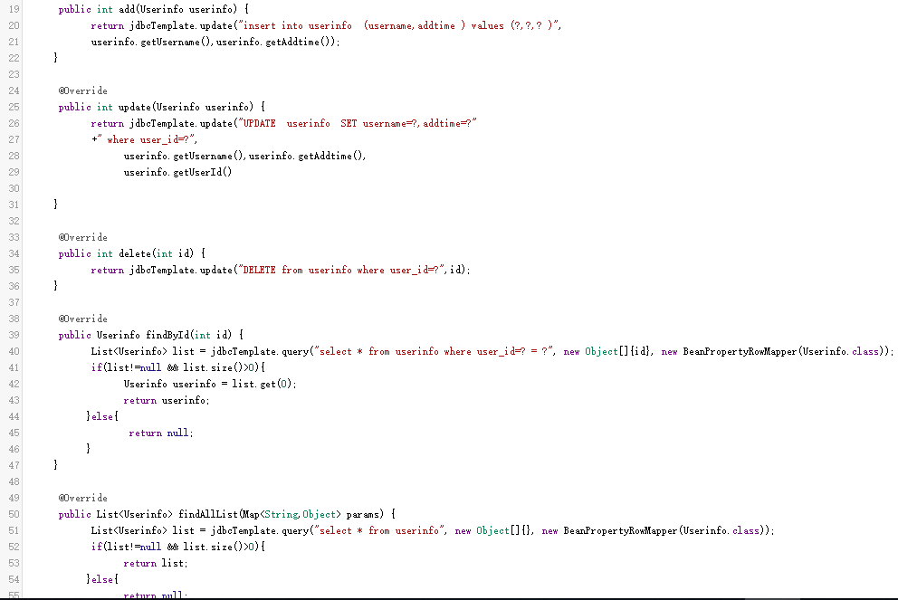

 

SpringBootCodeGenerator
----
基于SpringBoot2+Freemarker的代码生成器，用DDL SQL语句生成JPA/JdbcTemplate/Mybatis/BeetlSQL相关代码，支持mysql/oracle/pgsql三大数据库。以释放双手为目的，各大模板也在陆续补充和优化。欢迎大家提交模板和交流想法！
  
另外，感谢bejson三叔将他部署在http://java.bejson.com/generator上，成为besjon专供工具。
  
<table><tbody>
<tr><td>访问路径</td> <td>http://127.0.0.1:1234/generator</td></tr>
<tr><td>在线地址</td> <td>http://java.bejson.com/generator</td></tr>
<tr><td>CSDN博客</td> <td>http://blog.csdn.net/moshowgame</td></tr>
<tr><td></td> <td></td></tr>
<tr><td>更新日期</td> <td>更新内容</td></tr>
<tr><td>20181003<td>新增element-ui/bootstrap生成。</td></tr>
<tr><td>20181002<td>修复公共CDN之Layer.js404问题，导致项目无法生成。</td></tr>
<tr><td>20180927<td>优化COMMENT提取逻辑，支持多种复杂情况的注释（感谢@raodeming的反馈）。</td></tr>
<tr><td>20180926<td>全新BeetlSQL模块，以及一些小细节优化（感谢@三叔同事的建议）。</td></tr>
<tr><td>20180925<td>优化SQL表和字段备注的推断，包括pgsql/oralce的comment on column/table情况处理等。</td></tr>
<tr><td>20180918<td>优化SQL类型推断。优化PrimaryKey判断。修复jpacontroller中Repository拼写错误问题。</td></tr>
<tr><td>20180917<td>全新首页，静态文件全部采用CDN。新增jdbcTemplate模块。</td></tr>
<tr><td>20180916-2<td>优化oracle支持，优化DDL语句中"或者'或者空格的支持。</td></tr>
<tr><td>20180916-1<td>补充char/clob/blob/json等类型，如果类型未知，默认为String。</td></tr>
<tr><td>20180915<td>新增Swagger-UI模板。修复一些命名和导入问题。JPA的Entity默认第一个字段为Id，如果不是请手工修改。</td></tr>
<tr><td>20180913<td>修复字段没有描述以及类型为DATE型导致的问题。新增JPA的Controller模板。</td></tr>
<tr><td>20180831<td>初始化项目。新增JPA系列Entity+Repository模板。</td></tr>
</tbody></table>

<table><tbody>
<tr><td>类名</td> <td>说明</td></tr>
<tr><td>tableName</td> <td>sql中的表名</td></tr>
<tr><td>className</td> <td>java类名</td></tr>
<tr><td>classComment</td> <td>java类备注</td></tr>
<tr><td>fieldName</td> <td>字段名</td></tr>
<tr><td>fieldComment</td> <td>字段备注</td></tr>
</tbody></table>

<table>